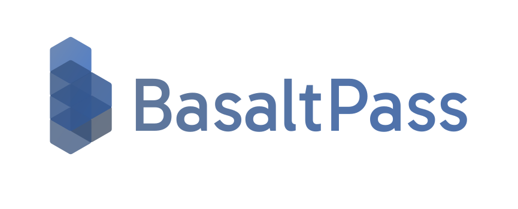

<p align="center">
  
</p>

# BasaltPass

BasaltPass is a production-ready, multi-tenant identity and access platform for modern SaaS systems.
It provides OAuth 2.0 / OIDC authentication, tenant-aware RBAC, and service-to-service (S2S) APIs in one unified stack.

## Why BasaltPass

- **Centralized AuthN/AuthZ**: One identity core for user, tenant, and admin experiences.
- **Multi-tenant by design**: Tenant isolation and scoped permission boundaries are first-class.
- **Standards-based integration**: OAuth 2.0, OIDC discovery, PKCE, token lifecycle, and interoperable client flows.
- **Operationally practical**: Local development scripts, containerized deployment, and production compose support.
- **Developer-focused**: Clear APIs, modular architecture, and dedicated documentation site.

## Core Capabilities

- User authentication flows (sign-in, account/session security, passkey/MFA related modules)
- OAuth 2.0 / OIDC authorization server endpoints
- Tenant management and tenant-level role/permission governance
- Admin control plane for system-wide operations
- S2S integration model for backend-to-backend authorization
- Subscription/payment related modules integrated with identity and tenant scope

## Architecture at a Glance

BasaltPass ships as three major parts:

- **Backend API**: Go service (`basaltpass-backend`), default port `8101`
- **Frontend Consoles**: React monorepo (`basaltpass-frontend`) with User / Tenant / Admin consoles
- **Documentation Site**: Docusaurus docs (`basaltpass-docs`)

Key local ports:

- Backend API: `8101`
- User console dev: `5101`
- Tenant console dev: `5102`
- Admin console dev: `5103`
- Frontend production mapping (container): `5104`

## Repository Structure

```text
BasaltPass/
├─ basaltpass-backend/              # Go API, auth services, domain/business modules
├─ basaltpass-frontend/             # React + TypeScript monorepo (user/tenant/admin)
├─ basaltpass-docs/                 # Docusaurus documentation site
├─ scripts/                         # Dev helper scripts (dev.sh / dev.ps1)
├─ docker-compose.yml               # Local compose orchestration
├─ .basalt.example/                 # Optional local Basalt app metadata template
├─ backend.Dockerfile
├─ frontend.Dockerfile
└─ README.md
```

## Quick Start

### Option A: Full Stack via Docker Compose

```bash
cd BasaltPass
docker compose --profile localdb up -d --build
```

This starts backend + frontend + local MySQL profile.

- Backend health: `http://localhost:8101/health`
- Backend readiness: `http://localhost:8101/api/v1/health`
- Frontend gateway: `http://localhost:5104`

### Option B: Native Dev Workflow (Recommended for active coding)

Linux/macOS:

```bash
cd BasaltPass
./scripts/dev.sh up
./scripts/dev.sh status
```

Windows PowerShell:

```powershell
cd BasaltPass
.\scripts\dev.ps1 up
.\scripts\dev.ps1 status
```

This mode runs backend + three frontend consoles on dedicated dev ports.

## Configuration

Configuration precedence:

1. Environment variables
2. Root `.env`
3. Backend defaults in `basaltpass-backend/config/config.yaml`

Important variables:

- `JWT_SECRET`
- `BASALTPASS_VERIFICATION_PEPPER`
- `BASALTPASS_SERVER_ADDRESS`
- `BASALTPASS_DATABASE_DRIVER`
- `BASALTPASS_DATABASE_DSN`
- `BASALTPASS_CORS_ALLOW_ORIGINS`

For production, always use a strong secret and an external managed database.

## OAuth / OIDC Support

BasaltPass currently supports the OIDC Authorization Code profile used by most
server-rendered apps, SPAs, mobile apps, and backend services:

- Authorization Code flow with `response_type=code`
- PKCE S256 for public clients and browser-based clients
- Required `nonce` when `scope` contains `openid`
- RS256 signed `id_token` returned from the token endpoint
- JWKS-based ID Token verification
- Scope-controlled `userinfo` claims
- Refresh tokens gated by `offline_access`
- Token introspection and revocation
- RP-initiated logout through `end_session_endpoint`
- Pairwise subject identifiers and JWT client authentication


With base URL `https://auth.example.com/api/v1`:

- `/.well-known/openid-configuration`
- `/oauth/authorize`
- `/oauth/token`
- `/oauth/userinfo`
- `/oauth/jwks`
- `/oauth/introspect`
- `/oauth/revoke`
- `/end_session`

The detailed client integration guide lives in
`basaltpass-docs/docs/integration/oauth2-oidc.md`. Historical implementation
notes are kept in `OIDC_REMEDIATION_PLAN.md`.

## Frontend Workspaces

`basaltpass-frontend` uses npm workspaces:

- `@basaltpass/console-user`
- `@basaltpass/console-tenant`
- `@basaltpass/console-admin`

Useful commands:

```bash
cd basaltpass-frontend
npm run dev:user
npm run dev:tenant
npm run dev:admin
npm run build
```

## SDKs

BasaltPass provides standalone SDK repositories for common integration
environments:

- [Go SDK](https://github.com/BasaltBase/BasaltPass_GoSDK)
- [Java SDK](https://github.com/BasaltBase/BasaltPass_JavaSDK)
- [JavaScript / TypeScript SDK](https://github.com/BasaltBase/BasaltPass_JSSDK)
- [Python SDK](https://github.com/BasaltBase/BasaltPass_PythonSDK)

## Testing

Backend unit/integration tests:

```bash
cd basaltpass-backend
go test ./...
```

Project-level test and verification scripts are available under `test/`.

## Deployment

Recommended production approach:

- Build and publish backend/frontend images (GHCR supported)
- Inject runtime configuration via `.env`
- Place BasaltPass behind HTTPS reverse proxy / ingress

See detailed deployment guidance in `docs/DEPLOYMENT.md`.

The repository includes Dockerfiles and a local `docker-compose.yml`. For
production, treat compose or Kubernetes manifests as environment-specific
deployment assets and keep secrets outside git.

## Documentation

The documentation site lives in `basaltpass-docs`.

Run locally:

```bash
cd basaltpass-docs
npm install
npm run start
```

## License

See `LICENSE` for licensing details.

---

If you are building multi-tenant SaaS products and need a secure, standards-compliant identity core, BasaltPass gives you a practical foundation that scales from local development to production operations.
